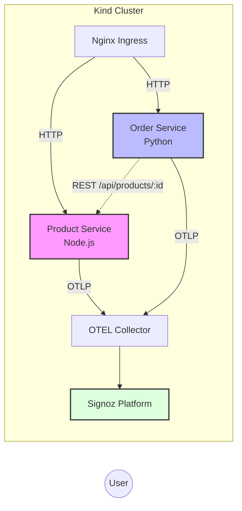

# Microservices Observability Demo with Signoz & OpenTelemetry

> **⚠️ DEMO ENVIRONMENT** - This repository provides a comprehensive reference architecture for observing microservices using Signoz and OpenTelemetry. It is intended for educational and demonstration purposes within a local Kubernetes environment.

[](https://opentelemetry.io/)
[](https://signoz.io/)
[](https://kind.sigs.k8s.io/)

This project demonstrates a production-grade observability stack implementing **Signoz** (Open Source Observability Platform) and **OpenTelemetry** (Vendor-neutral instrumentation). It simulates a realistic e-commerce environment with polyglot microservices (**Node.js** and **Python**) to showcase distributed tracing, metrics aggregation, and structured logging in a heterogeneous architecture.

## 🎯 Architecture Overview

The demo simulates a simplified e-commerce platform consisting of two primary microservices:

1.  **Product Service (Node.js)**: Manages the product catalog and categories.
2.  **Order Service (Python)**: Handles order processing and performs synchronous inter-service communication with the Product Service to validate items.

This architecture demonstrates common distributed system patterns and their observability requirements:

*   **Synchronous Inter-service Communication**: Tracing requests across service boundaries.
*   **Polyglot Environments**: Correlating telemetries from different languages.
*   **Error Propagation**: Visualizing how upstream errors affect downstream services.



## ⚡ Rapid Deployment

### Prerequisites

Ensure the following DevOps toolchain is available in your shell:

*   **Docker** (≥20.10)
*   **Kind** (≥0.20)
*   **Kubectl** (≥1.28)
*   **Helm** (≥3.12)

### Provisioning Infrastructure

Execute the bootstrap script to provision the Kubernetes cluster and deploy the complete stack:

```bash
./setup.sh
```

**Estimated Provisioning Time**: ~5-10 minutes.

The automation script performs the following idempotent operations:
1.  **Infrastructure Validation**: Checks for required binaries.
2.  **Cluster Provisioning**: Bootstraps a local Kind cluster.
3.  **Artifact Management**: Builds and preloads Docker images to the cluster control plane to avoid registry dependency.
4.  **Platform Deployment**: Installs Nginx Ingress Controller and the Signoz Observability Platform via Helm.
5.  **Application Deployment**: Deploys the microservices (Products & Orders).
6.  **Traffic Simulation**: Generates synthetic load to populate initial telemetry data.

### DNS Configuration

To simulate production routing on your local machine, map the ingress hosts in your `/etc/hosts` file:

```bash
# Append to /etc/hosts
127.0.0.1 signoz.localhost otel-example.localhost python-otel-example.localhost
```

## 🖥️ Service Endpoints

### Observability Platform

| Service | URL | Credentials |
| :--- | :--- | :--- |
| **Signoz UI** | [http://signoz.localhost](http://signoz.localhost) | **User**: `admin@mikroways.net`<br>**Pass**: `Mikroways123!` |

### Microservices

| Service | Hostname | Core Responsibility |
| :--- | :--- | :--- |
| **Product Service** | `otel-example.localhost` | Catalog queries (GET /api/products) |
| **Order Service** | `python-otel-example.localhost` | Order creation (POST /api/orders) |

## 🧪 Telemetry Generation & Analysis

### 1. Generating Synthetic Traffic

The platform includes endpoints designed to simulate user activity. Run the following shell loop to generate a mix of successful transactions and errors:

```bash
# Simulate realistic user behavior: browsing and purchasing
for i in {1..20}; do
  # 1. User browses catalog (Node.js Service)
  curl -s "http://otel-example.localhost/api/products" > /dev/null
  curl -s "http://otel-example.localhost/api/categories" > /dev/null
  
  # 2. User views specific product (Node.js Service)
  PRODUCT_ID=$((RANDOM % 5 + 1))
  curl -s "http://otel-example.localhost/api/products/${PRODUCT_ID}" > /dev/null
  
  # 3. User places an order (Python Service calls Node.js Service)
  curl -s -X POST "http://python-otel-example.localhost/api/orders" \
       -H "Content-Type: application/json" \
       -d "{\"product_id\": ${PRODUCT_ID}, \"quantity\": 1, \"user_id\": \"test-user\"}" > /dev/null

  # 4. Trigger occasional errors for analysis
  curl -s "http://otel-example.localhost/error" > /dev/null
  
  sleep 1
done
```

### 2. Monitoring & Debugging

Navigate to the Signoz UI to analyze the captured telemetry.

#### 🔍 Distributed Tracing
*   **Scenario**: Analyze the `POST /api/orders` flow.
*   **Observation**: Identify the specific span where the Python service makes an HTTP request to the Node.js service (`GET /api/products/:id`).
*   **Goal**: Validate latency attribution between the Order Service processing and the external Product Service dependency.

#### 📈 Metrics & Dashboarding
*   Access the **"OpenTelemetry Demo - Professional Overview"** dashboard.
*   Review RED method metrics (Rate, Errors, Duration) for each service.
*   Compare resource utilization and throughput between the Node.js and Python runtimes.

#### 📝 Structured Logging
*   Inspect logs for the `otel-demo-app` (Node.js) and `otel-python-app` (Python).
*   Verify that `trace_id` and `span_id` are automatically injected into log context, enabling direct correlation from a log line to the specific distributed trace.

## 🔧 Instrumentation Implementation

The repository implements industry-standard OpenTelemetry instrumentation patterns:

*   **Node.js**: Uses `@opentelemetry/sdk-node` with auto-instrumentation for Express and HTTP modules. trace context propagation is handled automatically for downstream calls.
*   **Python**: Uses `opentelemetry-distro` with Flask instrumentation. Demonstrates manual span creation and attribute injection for business logic monitoring.

## 🐛 Troubleshooting

*   **Pods Pending**: Check cluster resources. Signoz + ClickHouse requires significant RAM (allocated 4GB+ to Docker).
*   **Ingress 404**: Ensure `/etc/hosts` mapping is correct and Ingress Controller pod is `Running`.
*   **Missing Data**: Verify OTEL Collector connectivity using `kubectl logs -n monitoring -l app=signoz-otel-collector`.

## ⚖️ License

MIT License. See [LICENSE](./LICENSE) for full text.

---
**Maintained by DevOps Engineering Team**
*Reference implementation for internal training and architecture validation.*
